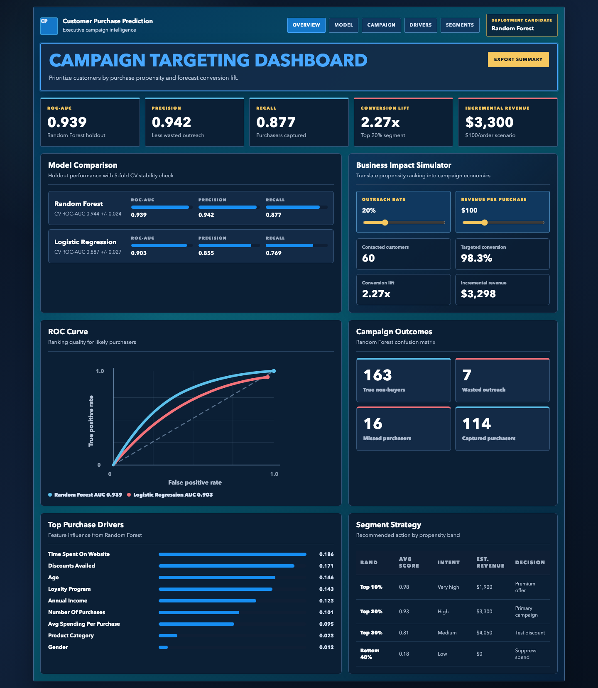
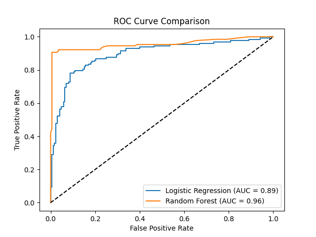
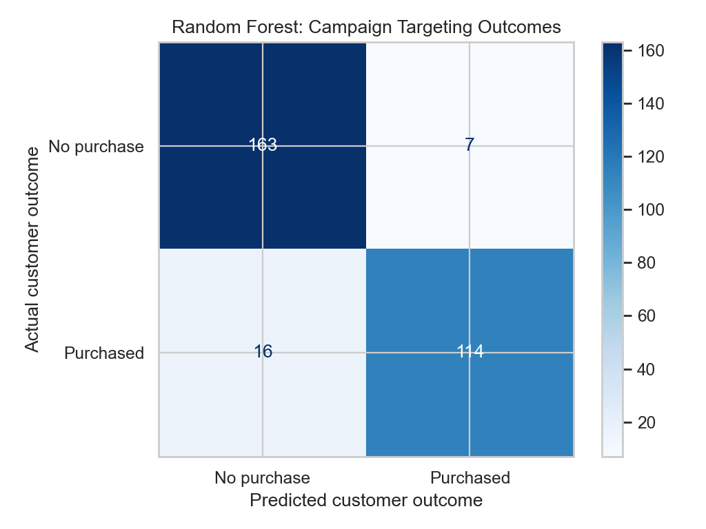
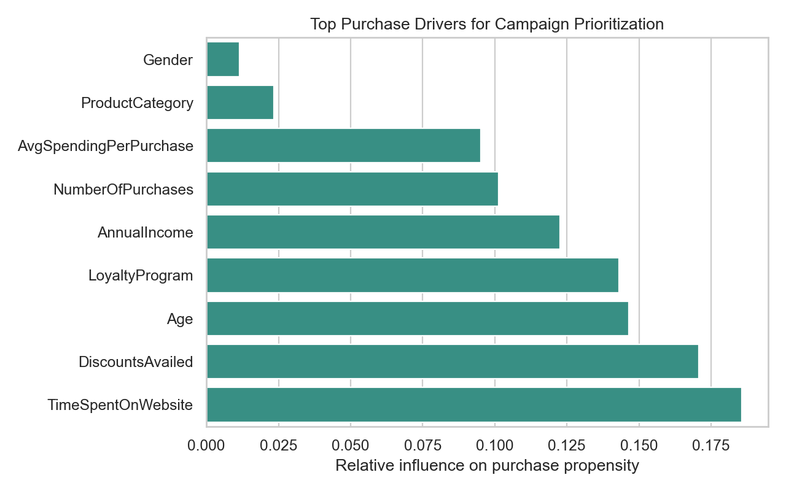

# Customer Purchase Prediction

Most marketing teams do not lack customers to contact.

They lack a reliable way to decide which customers are most worth contacting first.

When every prospective customer receives the same campaign treatment, budget is spent on low-intent audiences, high-propensity buyers can be under-prioritized, and teams are left judging campaign performance after the money has already been spent. Traditional campaign segmentation often reinforces that problem because it relies on broad demographic cuts or historical averages instead of estimating customer-level purchase intent.

This project asks a more useful question for marketing leaders:

**Which customers are most likely to purchase, and which behavioral signals should guide campaign targeting?**

To answer it, I built a reproducible purchase propensity modeling workflow, compared an interpretable Logistic Regression baseline against a nonlinear Random Forest classifier, and translated the results into an executive dashboard for campaign prioritization and business impact planning.

**Live dashboard:** https://customerpurchaseprediction-six.vercel.app  
**Repository:** https://github.com/JoshuaColePhD/Customer_Purchase_Prediction

[](frontend/)

*The dashboard turns model results into a campaign decision tool with KPI tracking, model comparison, purchase-driver interpretation, segment strategy, and a configurable revenue impact simulator.*

## The Story

Imagine a marketing leader with a fixed outreach budget and a list of 1,500 prospective customers.

The business does not need to know only whether the model can classify purchase status. It needs to know where campaign spend is most likely to produce a return, which signals explain that ranking, and how much lift a targeting strategy could create compared with broad outreach.

A simple campaign rule might target customers by one obvious trait, such as income or product category. But purchase intent is usually a mix of behavior, relationship depth, and responsiveness: time spent on the website, discount use, loyalty participation, past purchase frequency, and economic value.

This project treats purchase prediction as a prioritization problem. The model estimates purchase propensity, ranks customers by likelihood to buy, and helps a stakeholder choose an outreach threshold based on budget, precision, recall, and expected revenue.

The result is not just a classifier. It is a clearer campaign question:

**Where should marketing spend the next dollar of outreach?**

## What the Analysis Found

The strongest signal in this dataset is behavioral engagement.

Customers who spend more time on the website, respond to discounts, participate in the loyalty program, and show stronger purchase history contribute more to purchase prediction than broad demographic segmentation alone. In business terms, the model points marketing toward active intent signals rather than generic audience assumptions.

| Finding | Evidence | What it means for leaders |
| --- | ---: | --- |
| Random Forest is the strongest deployment candidate | ROC-AUC = 0.939, precision = 0.942, recall = 0.877 | Use the nonlinear model for propensity ranking because it captures stronger signal without sacrificing campaign precision. |
| Logistic Regression remains a useful baseline | ROC-AUC = 0.903 | Keep the baseline as an interpretability and sanity-check benchmark. |
| Engagement and offer response drive prediction | Top drivers include website time, discounts availed, loyalty program, and purchase frequency | Prioritize recent behavioral and relationship signals over broad demographic targeting. |
| Targeting the top 20% creates meaningful lift | 98.3% conversion rate versus 43.3% baseline, or 2.27x lift | Use propensity score bands to focus campaign spend where expected return is highest. |
| The top-20% scenario has clear revenue framing | About $3,300 incremental revenue at $100 per purchase in the holdout simulation | Translate model performance into budget and ROI discussion, not just accuracy metrics. |

Full model outputs and generated visualizations are saved in `figures/`.

## From Finding to Action

The practical value of this project is not that it predicts purchase status in isolation. It gives marketing teams a sequence for campaign decision-making.

1. **Rank customers by purchase propensity.** Use predicted probabilities to prioritize customers instead of treating the full audience as equally valuable.
2. **Choose a campaign threshold based on budget.** When outreach capacity is tight, target the highest-score bands to protect precision and reduce wasted touches.
3. **Adjust reach based on campaign goals.** For awareness or product-launch campaigns, lower the threshold and monitor recall, conversion lift, and revenue per band.
4. **Use drivers to shape messaging.** Website engagement, discount behavior, loyalty status, and purchase history can inform offer design and channel strategy.
5. **Monitor lift after each campaign.** Recalibrate thresholds as customer behavior, seasonality, promotions, and acquisition channels shift.

## The Dashboard

The dashboard turns the model outputs into an executive decision-support tool. The goal is to help a stakeholder understand the campaign story quickly: how the models compare, what drives purchase intent, which segments deserve priority, and what the revenue impact could be under different outreach assumptions.

Dashboard features:

- KPI strip for ROC-AUC, precision, recall, conversion lift, and incremental revenue
- Model comparison for Logistic Regression versus Random Forest
- Interactive outreach-rate and revenue-per-purchase simulator
- Business-labeled ROC curve and Random Forest confusion matrix
- Feature importance view for top purchase drivers
- Segment strategy table for campaign prioritization by propensity band
- Markdown export for an executive summary

Run the dashboard locally:

```bash
cd frontend
npm install
npm run dev
```

Build for Vercel:

```bash
cd frontend
npm run build
```

Vercel settings:

| Setting | Value |
| --- | --- |
| Root directory | `frontend` |
| Build command | `npm run build` |
| Output directory | `dist` |

## Methodology

### Data

| Attribute | Value |
| --- | --- |
| File | `data/customer_purchase_data.csv` |
| Unit of analysis | Customer |
| Rows | 1,500 |
| Baseline purchase rate | 43.3% |
| Target | `PurchaseStatus` |
| Modeling task | Binary classification and propensity ranking |

The dataset contains demographic, behavioral, purchase-history, loyalty, discount, and product-category features. An economic-value feature, `AvgSpendingPerPurchase`, is engineered to normalize annual income by purchase frequency.

### Pipeline

The project is implemented as a reproducible scikit-learn workflow in `src/main.py`.

1. Load customer-level data from `data/customer_purchase_data.csv`.
2. Engineer `AvgSpendingPerPurchase`.
3. Split data into stratified train/test samples to preserve purchase-rate balance.
4. Apply preprocessing inside sklearn pipelines:
   - Median imputation and standard scaling for numeric features.
   - Most-frequent imputation and one-hot encoding for categorical features.
5. Train Logistic Regression and Random Forest classifiers with identical preprocessing contracts.
6. Validate model stability with 5-fold stratified cross-validation using ROC-AUC.
7. Evaluate holdout performance using accuracy, precision, recall, ROC-AUC, confusion matrices, and ROC curves.
8. Export business-labeled visualizations and Random Forest feature importances.

This structure avoids leakage because imputation, scaling, encoding, and feature creation are fit only on training folds during cross-validation and model training.

### Features

| Feature | Type | Why it matters |
| --- | --- | --- |
| `TimeSpentOnWebsite` | Behavioral | Captures engagement intensity and near-term purchase intent. |
| `DiscountsAvailed` | Behavioral | Measures promotion sensitivity and offer responsiveness. |
| `LoyaltyProgram` | Behavioral / relationship | Indicates brand relationship depth and repeat-purchase potential. |
| `NumberOfPurchases` | Behavioral | Captures historical buying frequency. |
| `AvgSpendingPerPurchase` | Engineered | Normalizes income by purchase frequency to approximate customer economic value. |
| `AnnualIncome` | Demographic / capacity | Proxies purchasing power. |
| `Age`, `Gender`, `ProductCategory` | Demographic / preference | Provides secondary segmentation context. |

## Model Results

| Model | Accuracy | Precision | Recall | ROC-AUC | CV ROC-AUC |
| --- | ---: | ---: | ---: | ---: | ---: |
| Logistic Regression | 0.843 | 0.855 | 0.769 | 0.903 | 0.887 +/- 0.027 |
| Random Forest | 0.923 | 0.942 | 0.877 | 0.939 | 0.944 +/- 0.024 |

### ROC Curve

The ROC curve compares each model's ability to rank likely purchasers above non-purchasers.



### Confusion Matrix

The Random Forest materially reduces both missed purchasers and wasted outreach compared with the baseline.



### Feature Importance

Random Forest feature importance identifies the strongest purchase drivers:

| Feature | Importance |
| --- | ---: |
| TimeSpentOnWebsite | 0.1856 |
| DiscountsAvailed | 0.1707 |
| Age | 0.1465 |
| LoyaltyProgram | 0.1432 |
| AnnualIncome | 0.1226 |
| NumberOfPurchases | 0.1013 |
| AvgSpendingPerPurchase | 0.0951 |
| ProductCategory | 0.0234 |
| Gender | 0.0116 |



## Reproducing the Project

Install Python dependencies and regenerate the analysis outputs:

```bash
pip install -r requirements.txt
python src/main.py
```

The script prints model metrics, feature importances, and a business impact scenario, then regenerates all visual outputs in `figures/`.

Generated figures include:

- `roc_curve_comparison.png`
- `roc_curve_logistic_regression.png`
- `roc_curve_random_forest.png`
- `confusion_matrix_logistic.png`
- `confusion_matrix_random_forest.png`
- `feature_importance_random_forest.png`
- `feature_importance_random_forest.csv`
- `purchase_status_distribution.png`
- `boxplots_by_purchase_status.png`

## Project Structure

```text
Customer_Purchase_Prediction/
├── data/                       # Customer purchase dataset
├── figures/                    # Generated model and dashboard visuals
├── frontend/                   # Vite React dashboard
├── src/                        # scikit-learn modeling pipeline
├── requirements.txt
├── vercel.json
└── README.md
```

## Portfolio Skills Demonstrated

- Marketing analytics problem framing
- Purchase propensity modeling
- Leakage-safe preprocessing with sklearn pipelines
- Baseline and nonlinear model comparison
- Cross-validation plus holdout evaluation
- Model interpretation connected to campaign strategy
- Business impact simulation for conversion lift and revenue
- Executive dashboard design for non-technical stakeholders
- Deployable frontend packaging for Vercel

## Contact

**Joshua Cole, PhD**  
People Analytics / Data Analytics  
GitHub: https://github.com/JoshuaColePhD
